# Entity Guard for Home Assistant

<a href="https://github.com/italo-lombardi/Home-Assistant-EntityGuard/releases"></a>
<a href="https://github.com/hacs/integration"></a>
<a href="https://github.com/italo-lombardi/Home-Assistant-EntityGuard"></a>
<a href="https://www.home-assistant.io/"></a>
<a href="https://github.com/italo-lombardi/Home-Assistant-EntityGuard/blob/main/LICENSE"></a>


[](https://my.home-assistant.io/redirect/hacs_repository/?owner=italo-lombardi&repository=Home-Assistant-EntityGuard&category=integration)
[](https://my.home-assistant.io/redirect/config_flow_start/?domain=entity_guard)

Enforce desired entity state in Home Assistant via declarative rules. Replaces N hand-written auto-off / auto-lock / kill-switch automations with a single rule each, with built-in cooldowns, rate limiting, persistence, and a custom dashboard card.


---

## Features

- **Declarative rules** -- bind 1+ target entities to a trigger and target state; integration enforces it
- **State mode** -- force entity to a target state when it enters one of N trigger states
- **Attribute mode** -- clamp a numeric attribute (brightness, volume, temperature, percentage) against a threshold
- **Conditional flags** -- list of `(entity, match_state)` conditions AND'd; rule only fires when all match
- **Per-entity cooldown / debounce** -- avoid loop fights with the original cause
- **Per-rule rate limiter** -- cap enforcements/min; auto-suppress on overshoot to break loops
- **Domain-aware service mapping** -- light, switch, lock, cover, media_player, climate, fan, input_boolean
- **Safety acknowledgment** -- explicit confirmation required for cover/lock/climate rules
- **Suppress / unsuppress services** -- temporary pause without disabling the rule
- **Panic stop service** -- emergency disable of every rule + 60 min suppression
- **Master switch (Hub)** -- single global kill-switch across all rules
- **Logbook integration** -- every enforcement, skip, loop detection, and suppression logged
- **Custom Lovelace card** -- per-rule status, counters, controls
- **Self-managed storage** -- no recorder dependency; cooldowns and counters survive restarts
- **No pip dependencies**

---

## Installation

### HACS (Recommended)

1. Open HACS in your Home Assistant instance.
2. Go to **Integrations** and click the three-dot menu.
3. Select **Custom repositories**.
4. Add `https://github.com/italo-lombardi/Home-Assistant-EntityGuard` with category **Integration**.
5. Click **Install** and restart Home Assistant.

### Manual

1. Download the [latest release](https://github.com/italo-lombardi/Home-Assistant-EntityGuard/releases).
2. Copy the `custom_components/entity_guard/` folder into your `config/custom_components/` directory.
3. Restart Home Assistant.

---

## Configuration

This integration uses a config flow accessible from **Settings > Devices & Services > Add Integration > Entity Guard**.

Adding the integration takes you straight into rule creation. The **Entity Guard Hub** (global master switch) is created automatically the first time you save a rule — no separate setup step required.

### Step 1: Rule Basics

| Field | Description |
|-------|-------------|
| Rule name | A descriptive name for the rule (e.g., "Front door auto-lock") |
| Target entities | One or more entities the rule will enforce |
| Mode | `state` (force a specific state) or `attribute` (clamp a numeric attribute) |

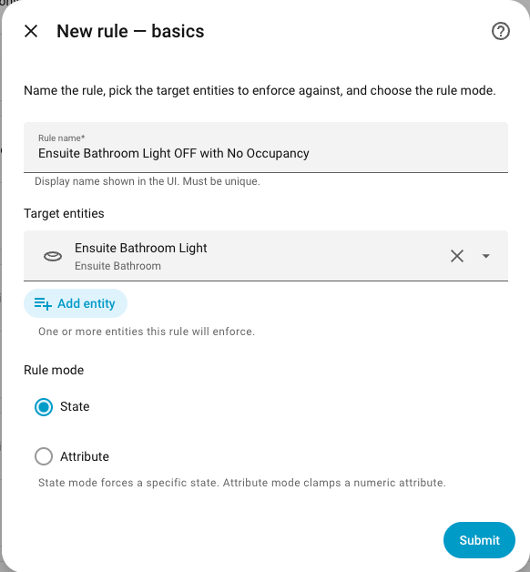

### Step 2a: State Mode

| Field | Default | Description |
|-------|---------|-------------|
| Trigger states | `["on"]` | One or more states that trigger enforcement |
| Target state | `off` | State to force the entity into |
| Delay (seconds) | `0` | Wait this long after the trigger before enforcing (0-86400) |

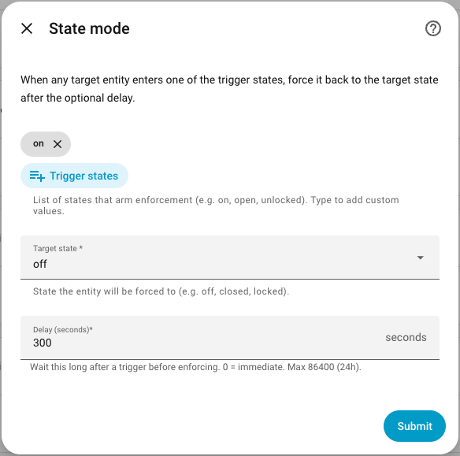

### Step 2b: Attribute Mode

| Field | Description |
|-------|-------------|
| Attribute | One of `brightness`, `volume_level`, `temperature`, `percentage` |
| Operator | `<`, `<=`, `>`, `>=` (equality comparisons unsupported -- float precision) |
| Threshold | Numeric value to compare against |
| Target value | Value to clamp the attribute to when the threshold is crossed |
| Delay (seconds) | Wait this long before enforcing (0-86400) |

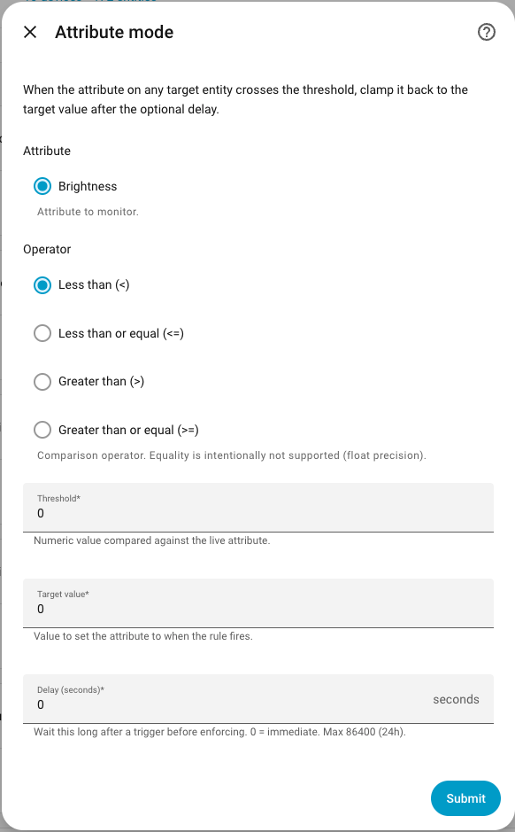

### Step 3: Flags (optional)

Define a list of `(flag entity, match state)` conditions. The rule only fires when **all** flags match. Unavailable flag entities count as a mismatch (fail-safe).

Example: a curfew flag (`input_boolean.kids_curfew == "on"`) AND a presence flag (`person.parent == "not_home"`).

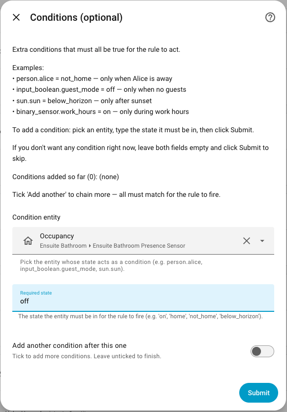

When editing a rule's flags via **Configure → Edit flag conditions**, you have four actions:

- **Add** — append the new condition to the existing list
- **Replace** — clear all existing conditions and save only the new one
- **Clear** — remove all conditions
- **Exit without changes** — leave the list as-is

If a flag entity is later deleted from Home Assistant, Entity Guard surfaces a **Repair issue** (Settings → System → Repairs) so you know which rule references the missing entity. The rule will not enforce while flags cannot be evaluated.

### Step 4: Advanced

| Field | Default | Description |
|-------|---------|-------------|
| Debounce enabled | `false` | Suppress repeat enforcement within the debounce window |
| Debounce (seconds) | `60` | Window during which a re-trigger is ignored (0-86400) |
| Max enforcements per minute | `10` | Auto-suppresses the rule for 15 minutes if exceeded |

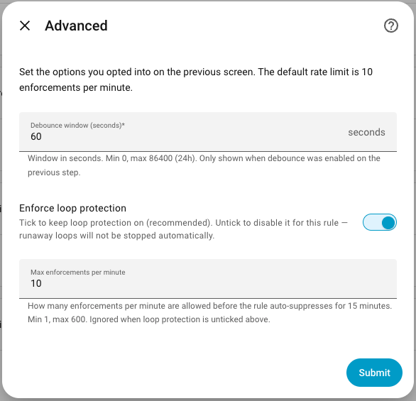

### Step 5: Safety Acknowledgment (cover / lock / climate only)

If any target entity is in the `cover`, `lock`, or `climate` domain, you must check the safety acknowledgment box before the rule can be saved. This is a deliberate seatbelt against rules that physically move things.

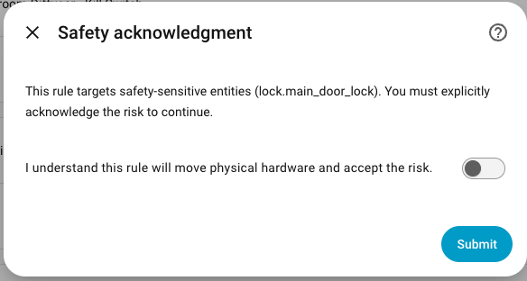

### Step 6: Preview

Review the assembled rule before saving. Confirm to create the config entry. The Entity Guard Hub is created automatically alongside your first rule.

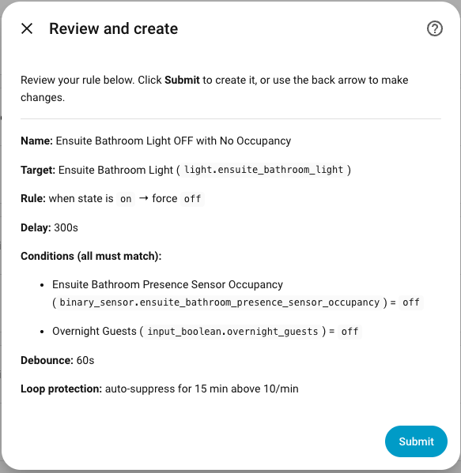

---

## Entities created per rule

**Visible by default**

| Entity | Description |
|--------|-------------|
| `switch.<rule>_enabled` | Master toggle for this rule |
| `switch.<rule>_debounce_enabled` | Toggle the debounce window |
| `number.<rule>_delay_seconds` | Delay before enforcing |
| `number.<rule>_debounce_seconds` | Debounce window length |
| `number.<rule>_max_enforcements_per_minute` | Per-rule rate limit |
| `binary_sensor.<rule>_armed` | Rule is watching (flag matched, master/enabled on) |
| `binary_sensor.<rule>_active` | Service call currently in flight |
| `binary_sensor.<rule>_in_cooldown` | Cooldown active for at least one bound entity |
| `sensor.<rule>_status` | Enum: `error` > `disabled` > `suppressed` > `enforcing` > `cooldown` > `armed` > `conditional` > `starting` > `pending` |
| `sensor.<rule>_last_enforced` | Timestamp of the last successful enforcement |
| `sensor.<rule>_enforcement_count_today` | Resets at local midnight |
| `button.<rule>_reset` | Clear all cooldowns for this rule |
| `button.<rule>_test_enforce` | Force an enforcement once (for testing) |

**Hidden by default** (enable manually in entity registry)

| Entity | Description |
|--------|-------------|
| `sensor.<rule>_enforcement_count_total` | Lifetime enforcement count |
| `sensor.<rule>_cooldown_remaining` | Seconds left on current cooldown |
| `sensor.<rule>_safety_status` | Visible only for cover/lock/climate rules |
| `sensor.<rule>_suppressed_until` | Timestamp when suppression ends |
| `sensor.<rule>_blocked_entities` | Count + list of entities currently in cooldown |

---

## Hub entity (global)

| Entity | Description |
|--------|-------------|
| `switch.entity_guard_master_enabled` | Global kill-switch. When off, every rule is `disabled`. |

---

## Status state machine

`sensor.<rule>_status` reports one of ten values, by priority (highest wins):

1. `error` -- 3+ consecutive enforcement failures (e.g. target unavailable). Auto-clears on next success or via `clear_history`.
2. `master_disabled` -- hub master switch is OFF (overrides every per-rule state below)
3. `disabled` -- per-rule `enabled=OFF`
4. `suppressed` -- suppress service active
5. `enforcing` -- service call currently in flight (transient)
6. `cooldown` -- post-enforcement cooldown active
7. `pending` -- delayed enforcement armed, waiting on `delay_seconds`
8. `armed` -- flags match, watching
9. `conditional` -- one or more flag entities do not match required state
10. `starting` -- inside the startup grace window

---

## Services

| Service | Description |
|---------|-------------|
| `entity_guard.suppress` | Pause a rule for `duration_minutes` (1-1440). Auto-resumes. |
| `entity_guard.unsuppress` | Resume a suppressed rule immediately. |
| `entity_guard.list_rules` | Return every rule's config + current status (response service). |
| `entity_guard.clear_history` | Clear cooldowns, counters, and last-enforced for a rule. |
| `entity_guard.panic_stop` | Disable every rule, suppress 60 min, turn off the master switch. |

---

## Events

Every rule action fires a Home Assistant event:

| Event | Fired when |
|-------|------------|
| `entity_guard_enforced` | Successful enforcement |
| `entity_guard_skipped` | Enforcement skipped (target unavailable, flag mismatch) |
| `entity_guard_loop_detected` | Rate limit hit; rule auto-suppressed |
| `entity_guard_suppressed` | Suppress service called |

All four are described in the Logbook.

---

## Examples

### Auto-lock front door 10 seconds after unlock

| Setting | Value |
|---------|-------|
| Target entities | `lock.front_door` |
| Mode | state |
| Trigger states | `unlocked` |
| Target state | `locked` |
| Delay (seconds) | `10` |
| Debounce | enabled, 30s |
| Safety acknowledged | yes |

### Kids' TV off after curfew

| Setting | Value |
|---------|-------|
| Target entities | `media_player.kids_tv` |
| Mode | state |
| Trigger states | `on`, `playing`, `paused` |
| Target state | `off` |
| Flags | `input_boolean.kids_curfew == on` |

### Diffuser low-water lockout

| Setting | Value |
|---------|-------|
| Target entities | `switch.diffuser_mist` |
| Mode | state |
| Trigger states | `on` |
| Target state | `off` |
| Flags | `binary_sensor.diffuser_water_low == on` |

### Brightness clamp at night

| Setting | Value |
|---------|-------|
| Target entities | `light.kids_bedroom` |
| Mode | attribute |
| Attribute | `brightness` |
| Operator | `>` |
| Threshold | `64` |
| Target value | `64` |
| Flags | `input_boolean.night_mode == on` |

---

## Lovelace card

The custom card auto-registers when the integration loads. Add it to a dashboard with:

```yaml
type: custom:entity-guard-card
rule_id: <config_entry_id>
title: "Living Room"        # optional override
show_stats: true             # default: true  (enforcement counters)
show_last_enforced: true     # default: true
show_entities: true          # default: true
show_conditions: false       # default: false
show_actions: false          # default: false
```

The card shows:
- Rule name and color-coded status badge (armed / enforcing / suppressed / cooldown / conditional / error / master_disabled)
- Enforcement counters (today / total) — togglable via `show_stats`
- Last enforced timestamp and cooldown indicator — togglable via `show_last_enforced`
- Bound entities with compliance state (✓ compliant / ⚠ violation)
- Optional **Conditions** section (`show_conditions: true`) — lists each flag with current vs required state; useful when status is `conditional`
- Optional action buttons (Test Enforce, Reset Cooldowns when active, Clear History, Suppress 1h)

**Normal state — rule armed, all entities compliant**

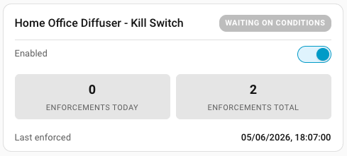

**Active enforcement — entity non-compliant**


**Suppressed state**

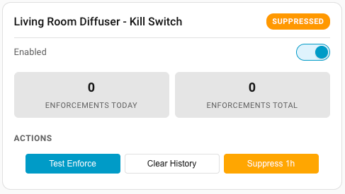

**Actions panel open**

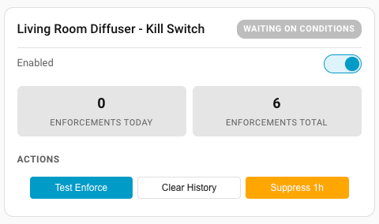

**Card editor**

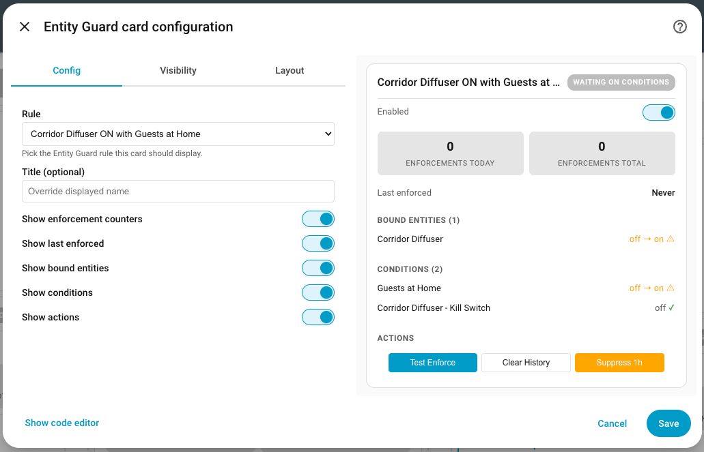

### Dashboard Example

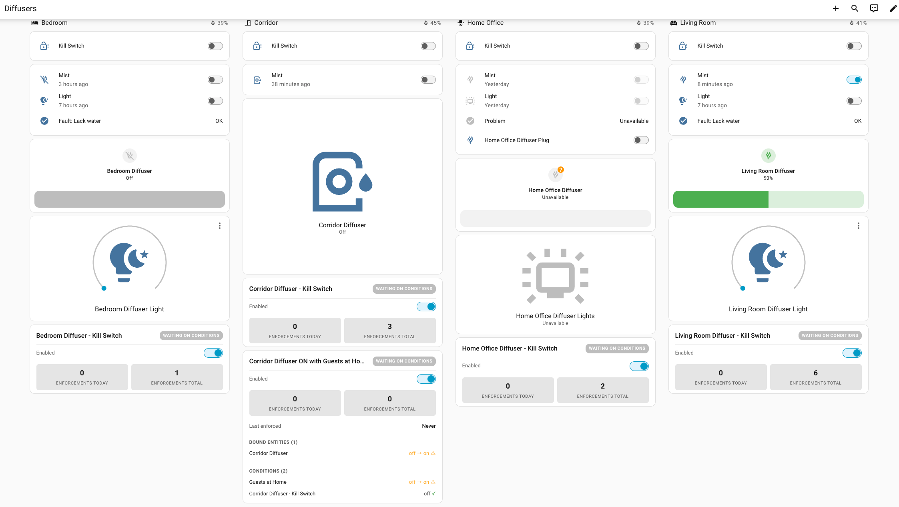

---

## FAQ

**Q: Does this integration require the Recorder component?**
A: No. Entity Guard uses its own `.storage` file for cooldowns and counters. Counters survive HA restarts.

**Q: What happens at HA startup?**
A: Rules are dormant for the first 60 seconds (startup grace). After that, every armed rule re-evaluates against current state and enforces if needed.

**Q: Multiple rules on the same entity -- what happens?**
A: They run independently. The per-rule rate limiter catches any thrash. A warning is shown at config time when this is detected.

**Q: A rule keeps fighting an automation. How do I diagnose?**
A: Watch for the `entity_guard_loop_detected` event in Logbook -- the rate limiter will auto-suppress the rule and fire it. Either raise `max_enforcements_per_minute`, add a debounce, or fix the conflicting automation.

**Q: How do I get notified when a rule fires?**
A: Listen to the `entity_guard_enforced` event in an automation and call your notify service of choice. The integration intentionally does not include built-in notifications -- you already have a notify service.

**Q: Does the test_enforce button do a dry-run?**
A: No -- it actually runs the configured enforcement. Use it on test entities or while the rule's `enabled` switch is off (which still allows test_enforce).

**Q: Why no `==` / `!=` operators in attribute mode?**
A: Float precision. `state == 0.5` is false more often than you'd expect on real sensor reports. Use `<=` / `>=` instead.

**Q: Can I suppress a rule indefinitely?**
A: No -- `suppress` requires a duration. For permanent pause, turn the rule's `enabled` switch off.

**Q: How do I read all sensor values in templates?**
A: Use `states()` for the main value and `state_attr()` for attributes. Example: `{{ state_attr('sensor.entity_guard_front_door_blocked_entities', 'entities') }}`.

---

## Contributing

Contributions are welcome! Please:

1. Fork the repository.
2. Create a feature branch (`git checkout -b feature/my-feature`).
3. Commit your changes with clear commit messages.
4. Open a Pull Request against `main`.

### Development Setup

```bash
git clone https://github.com/italo-lombardi/Home-Assistant-EntityGuard.git

python -m venv venv
source venv/bin/activate

pip install homeassistant pytest pytest-homeassistant-custom-component
```

### Running Tests

```bash
python -m pytest tests/ -v
```

### Guidelines

- Follow the [Home Assistant integration development guidelines](https://developers.home-assistant.io/).
- Add translations for any new user-facing strings.
- Write tests for new functionality.
- Keep PRs focused -- one feature or fix per PR.

---

## Sibling integrations

- [Entity Availability](https://github.com/italo-lombardi/Home-Assistant-EntityAvailability) — track offline entities, availability history, and degraded states with a custom dashboard card.
- [Entity Distance](https://github.com/italo-lombardi/Home-Assistant-EntityDistance) — distance between two or more entities (people, devices, zones) with direction, closing speed, ETA, and proximity sensors.
- [Fuel Compare](https://github.com/italo-lombardi/Home-Assistant-FuelCompare) — live fuel prices and station data for Irish petrol stations from fuelcompare.ie.

---

## License

GPL-3.0. See `LICENSE`.
